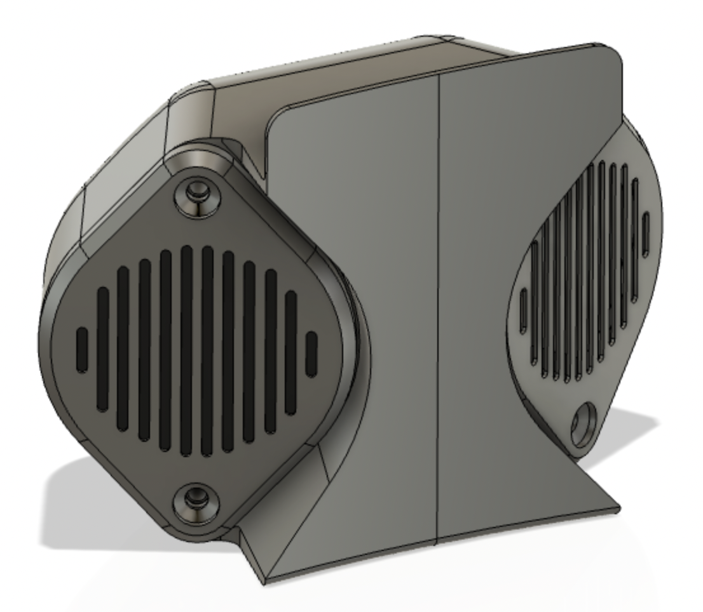
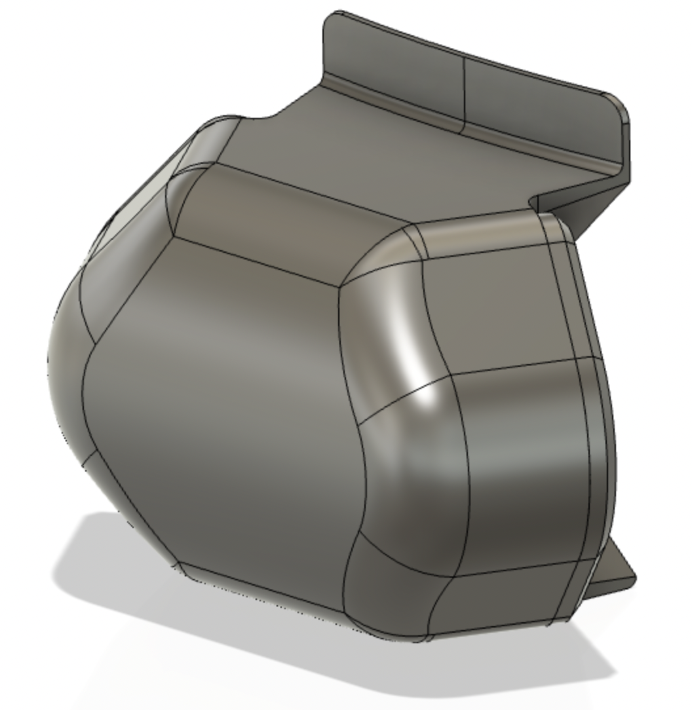

# RECARO RS-G x ROADSTER (ND) Headrest Speaker Mount

レカロのシェルRS-Gはロードスターでは定番のシートです。
NDロードスターの標準シートにはヘッドレストにスピーカーが内蔵されており、
Blutoothハンズフリー通話などはヘッドレストのスピーカーから音が出ます。
つまりRS-Gと一緒に、ヘッドレストスピーカーを移植しないと、
通話できないのです。

一般的にはシート背後の収納のフタや、
ロールバーのカバーにスピーカーを移植する例が多いようです。
これだとちょっとスピーカーが頭部から遠いのと、
プラ部品とはいえ、車両に穴をあけるのが嫌だったので、
シェルにスピーカーを取り付けるためのマウントを設計しました。

シェル背面のベルトホールを通して音声が聞こえる位置で、
かつあまりベルトホールから目立たないように配慮しました。

## BOM

+ 3Dプリンタ部品 4個 (ハウジングL, R, カバー2個)
+ M4 x L10mm ボルト 4個
+ 3M VHB両面テープ (シェルに固定する)
+ 黒テープ (ハウジング左右の接合部を隠す)
+ エポキシ接着剤 (ハウジング左右を接合する)
+ 結束バンド 5個程度
+ 結束バンドベース 両面テープ付 5個程度

## 組み立て

+ 標準シートから、スピーカー2個とケーブルを取り外してください。ケーブルのコネクタについているクリップは取り外せます。
+ 夏の車内は高温になるので3Dプリンタ部品はABSでプリントしてください。ハウジングは対称面をベッド面にします。カバーは表側をベッド面にします。サポートはなしで印刷可能なように設計しています。
+ ハウジングのベッド面は少し反るので、接着剤で接合しても隙間が生じます。かっこ悪いので黒いテープで隠しています。
+ ハウジングに対して、スピーカーとカバーを共締めしてください。ケーブルが長い方が右側です。ボルトはセルフタップで締め付け可能です。
+ 接着剤、両面テープで接合する部位はIPA等でしっかり脱脂してください。
+ スピーカーユニットは重いので、シェルには強力な両面テープで接着してください。3M VHBテープがおすすめです。
+ スピーカーのケーブルは結束バンドでまとめ、シェルに固定します。スピーカーケーブルのコネクタは白いしワイヤーは赤緑と、そのままでは見た目が良くないので、テープなどで巻いて隠します。

